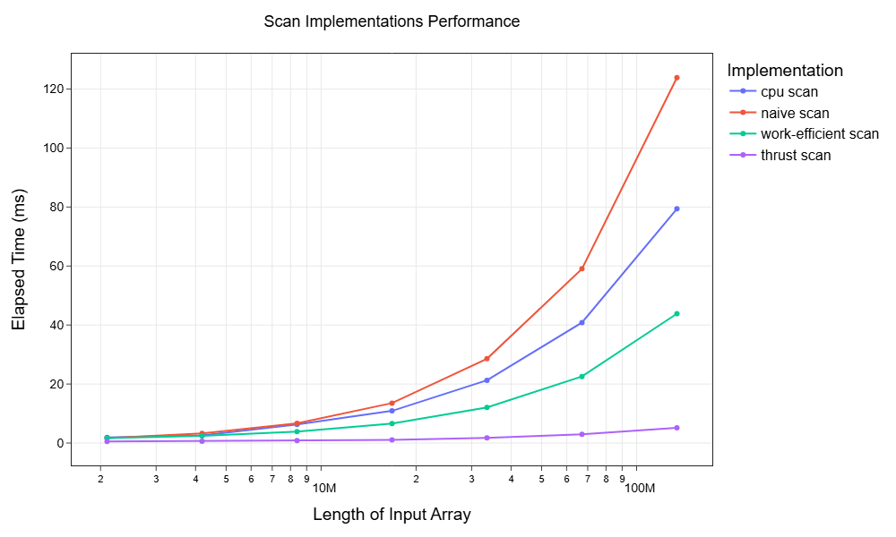
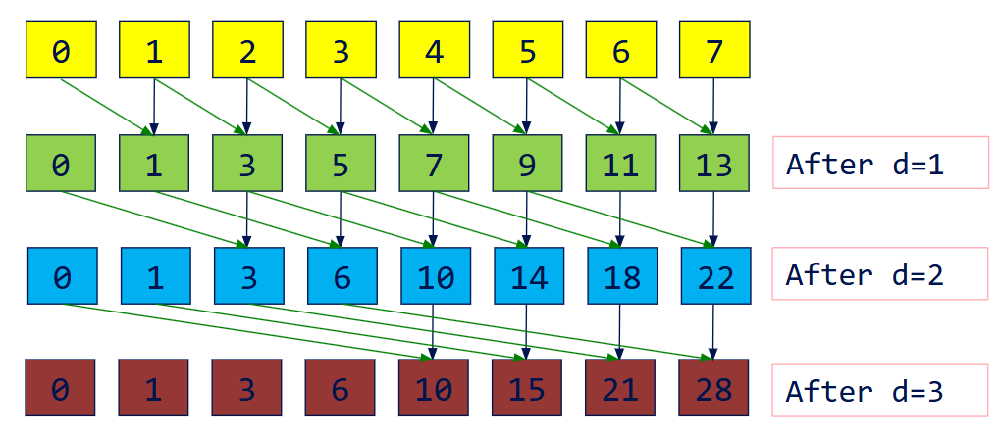
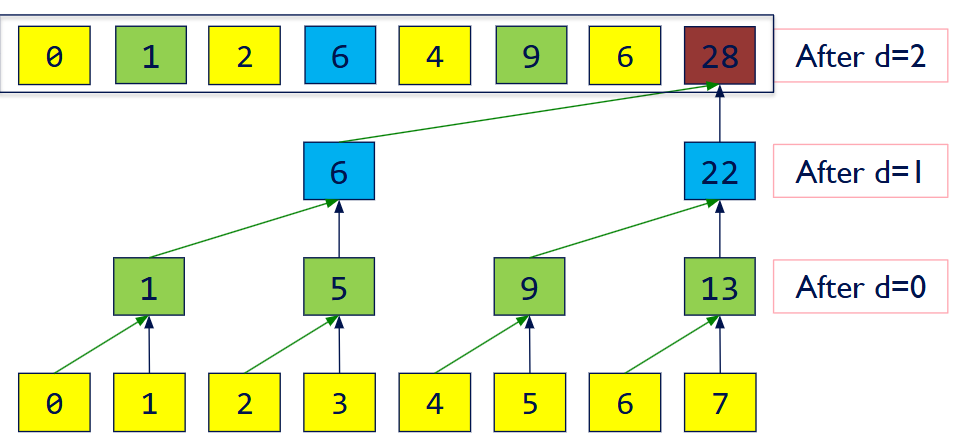
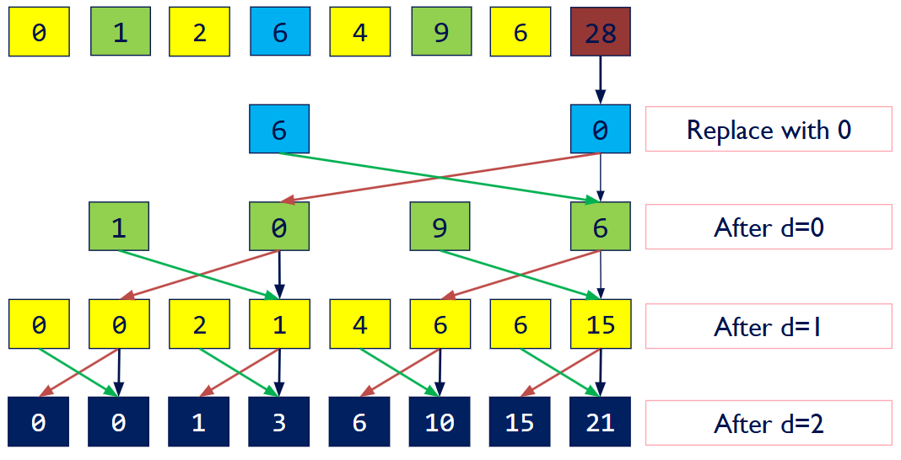
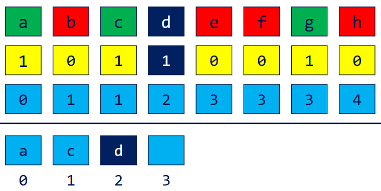
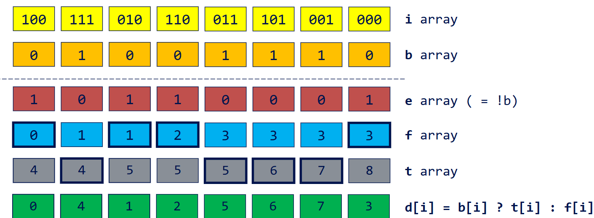
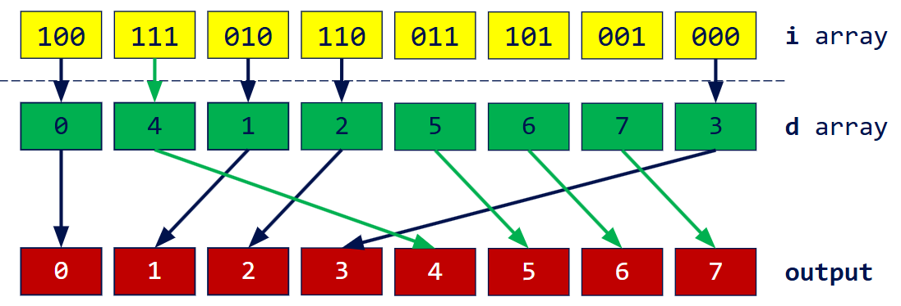
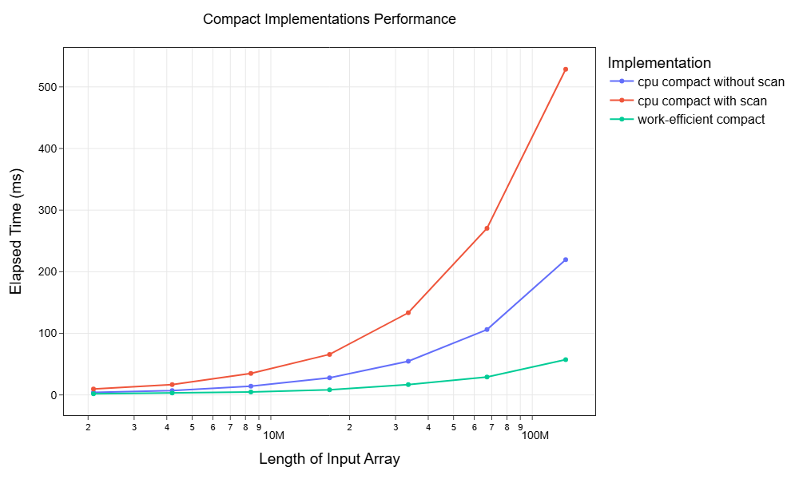

# CUDA Stream Compaction

**University of Pennsylvania, CIS 5650: GPU Programming and Architecture, Project 2**

**Author:** Lu Men ([LinkedIn](https://www.linkedin.com/in/lu-m-673425323/))

**Tested System:**
 - Windows 11 Home
 - AMD Ryzen 7 5800HS @ 3.20GHz, 16GB RAM
 - NVIDIA GeForce RTX 3060 Laptop GPU 6GB (Compute Capability 8.6)

## Abstract

This project implements and compares several scan and stream compaction algorithms on both CPU and GPU. The goal is to evaluate the performance and scalability of:
- CPU serial scan
- GPU naive parallel scan
- GPU work-efficient parallel scan
- NVIDIA Thrust library (`thrust::exclusive_scan()`)



Performance is measured for scan and stream compaction operations over large arrays, highlighting scalability and efficiency. Thrust provides the fastest professional implementation, while the work-efficient GPU scan significantly outperforms both CPU and naive GPU approaches at scale. The naive scan does not surpass CPU performance, likely due to inefficient thread utilization and memory access patterns.

---

## Build Instructions

1. Clone the repository:
   ```sh
   git clone https://github.com/M320322/Project2-Stream-Compaction.git
   ```
2. Navigate to the project directory:
   ```sh
   cd Project2-Stream-Compaction
   ```
3. Build with CMake:
   ```sh
   cmake -B build -S . -G "Visual Studio 17 2022"
   ```
4. Open the solution in Visual Studio:
   ```sh
   cd build
   start ./cis5650_stream_compaction_test.sln
   ```

---

## Methods

### CPU Sequential Scan


The CPU scan is a simple prefix sum algorithm, iterating through the input array and accumulating the sum. It serves as a baseline for performance comparison.

```c++
StreamCompaction::CPU::scan(int n, int *out, const int *in)
    out[0] = 0
    for k = 1 to n:
        out[k] = out[k-1] + in[k-1]
```

### Naive Parallel Scan (GPU)

The naive parallel scan uses multiple threads to compute partial sums in a stepwise fashion. Each iteration doubles the offset, but threads may overwrite values needed by others, requiring careful buffer management.



---

```c++
StreamCompaction::Naive::scan(int n, int *out, const int *in)
    for d = 1 to log2(n):
        for all k in parallel:
            if (k >= 2^(d-1)):
                out[k] = out[k - 2^(d-1)] + x[k]
            else:
                out[k] = in[k]
```

This implementation is simple but suffers from inefficient memory access and thread divergence, which limits its scalability and performance on large arrays.

### Work-Efficient Parallel Scan (GPU)

The work-efficient scan improves parallelism and memory access by using an upsweep and downsweep phase. It operates in-place and is more suitable for large-scale data.

#### Upsweep Phase



---

```c++
for d = 0 to log2(n) - 1:
    for all k = 0 to (n-1) by 2^(d+1) in parallel:
        x[k + 2^(d+1) - 1] += x[k + 2^d - 1]
```

#### Downsweep Phase


---

```c++
x[n-1] = 0
for d = log2(n) - 1 down to 0:
    for all k = 0 to n-1 by 2^(d+1) in parallel:
        temp = x[k + 2^d - 1]
        x[k + 2^d - 1] = x[k + 2^(d+1) - 1]
        x[k + 2^(d+1) - 1] += temp
```
The complete work-efficient parallel scan is implemented in the function `StreamCompaction::Efficient::scan(int n, int *out, const int *in)`.

### Stream Compaction

Stream compaction removes unwanted elements (e.g., zeros) from an array. The process involves:
1. Mapping the input array to a boolean array (1 for keep, 0 for discard).
2. Performing a scan on the boolean array to compute the output indices.
3. Scattering the valid elements to their new positions.



Parallel stream compaction is implemented in the function `StreamCompaction::Efficient::compact(int n, int *out, const int *in)`. It calls the work-efficient parallel scan for **Step 2** described above.

### Radix Sort

Radix sort leverages scan operations to sort integers by processing each bit position. For each bit:
1. Map input to a boolean array (true/false for bit value).
2. Scan the negated boolean array to count zeros.
3. Use the scan results to index and scatter elements into sorted positions.
4. Repeat for each bit from least to most significant.



---



Radix sort is implemented in the function `StreamCompaction::Efficient::sort(int n, int *out, const int *in)`. It calls the work-efficient parallel scan for **Step 2** described above.

### Thrust Library

NVIDIA's Thrust library provides highly optimized parallel primitives, including `thrust::exclusive_scan()` and `thrust::sort()`. These serve as benchmarks for professional GPU performance.

#### Thrust library functions are used in the following modules:
- `StreamCompaction::Thrust::scan(int n, int *out, const int *in)`
- `StreamCompaction::Thrust::thrustSort(int n, int *out, const int *in)`

---

## Results

Performance was measured on Release builds for input arrays ranging from $2^{21}$ (~2 million) to $2^{27}$ (~134 million) elements. The following plots illustrate scalability and efficiency:


**Scan Performance:**
- At $2^{27}$ (134 million elements):
  - Naive scan: 124 ms
  - CPU sequential scan: 80 ms
  - Work-efficient scan: 44 ms
  - Thrust scan: 5 ms

Thrust is the fastest, with work-efficient scan showing strong scalability. Naive scan is limited by memory and thread inefficiencies.



**Compaction Performance:**
- At $2^{27}$:
  - CPU sequential (no scan): 220 ms
  - CPU compact (with scan): 530 ms
  - Parallel compact (work-efficient scan): 57 ms

Parallel compaction is 4-8x faster than CPU approaches.

**Power-of-Two vs Non-Power-of-Two:**
CPU and naive algorithms are unaffected by array size alignment. Work-efficient scan pads arrays to the next power-of-two. Results suggest that array size has negligible impact on elapsed time and is thus not explicited discussed in this report.

**Radix Sort:**
Radix sort was implemented using work-efficient scan and compared to Thrust sort. Correctness was verified, but performance lags behind Thrust due to kernel launch overhead and array management.

```
==== thrust sort, power-of-two ====
   elapsed time: 74.97ms    (CUDA Measured)
==== thrust sort, non-power-of-two ====
   elapsed time: 40.63ms    (CUDA Measured)
==== radix sort, power-of-two ====
   elapsed time: 2170.37ms  (CUDA Measured)
  passed
==== radix sort, non-power-of-two ====
   elapsed time: 2170.83ms  (CUDA Measured)
  passed
```

Radix sort is correct but much slower than Thrust. My hypothesis is that my implementation involves repeated kernel launches and management of multiple temporary arrays, which can be inefficient. Future optimization is needed.

---

## Discussion & Bloopers

### Buffer Management in Naive Scan
In the naive parallel scan, ping-pong buffer management is critical. Initially, `cudaMemcpy()` was used to copy output to input between iterations, but this caused poor performance—even worse than the CPU. Switching to in-kernel buffer updates (`in[index] = out[index]`) improved performance significantly. This highlights the importance of minimizing host-device memory transfers and maximizing device-side computation.

### Timing and Measurement
Accurate timing is essential for fair benchmarking. Timers (`std::chrono` for CPU, CUDA timers for GPU) are placed around only the algorithmic code, excluding memory allocation and management. Initially, timers were embedded within scan functions, which conflicted with stream compaction timing. Refactoring the scan logic into helper functions allowed for modular timing and better organization.

### Lessons Learned
- Efficient memory access and thread utilization are crucial for GPU performance.
- Professional libraries like Thrust are highly optimized and difficult to match with custom implementations.
- Kernel launch overhead and array management can dominate runtime in complex algorithms like radix sort.
- Modular code organization aids in benchmarking and debugging.

---

## References

Figures and pseudocode adapted from [CIS5650-Fall-2025](https://github.com/CIS5650-Fall-2025) course materials.
